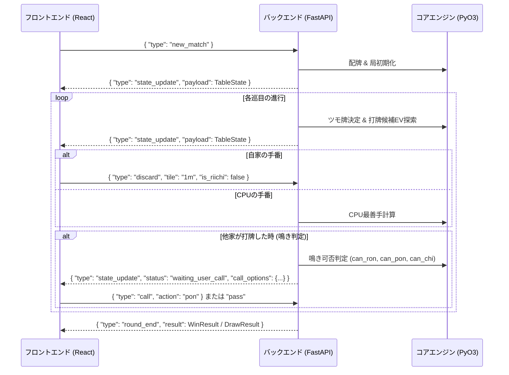

# 通信プロトコル仕様書 (WebSocket / REST API)

本ドキュメントでは、`mahjong-ui` フロントエンド（React）とバックエンド（FastAPI）間の通信プロトコル、イベントシーケンス、およびメッセージ形式を定義します。

---

## 1. 概要

フロントエンドとバックエンドは、リアルタイムな局進行を実現するために **WebSocket (`/ws/match`)** を主通信路として使用します。  
一部の対局初期化やドリル生成には **REST API** も提供されます。

---

## 2. WebSocket イベントシーケンス



---

## 3. クライアント送信メッセージ (Client -> Server)

| メッセージ種別 (`type`) | パラメータ | 説明 |
| :--- | :--- | :--- |
| `new_match` | なし | 新規対局（東1局）を開始 |
| `next_round` | なし | 次の局に進む |
| `discard` | `tile: str`, `is_riichi: bool` | プレイヤーの打牌 |
| `call` | `action: str` ("chi", "pon", "ron", "pass") | 鳴き・和了宣言 |
| `tsumo` | なし | ツモ和了宣言 |

---

## 4. サーバー送信メッセージ (Server -> Client)

### `state_update` ペイロード構造

```json
{
  "type": "state_update",
  "status": "waiting_user_discard", // または "waiting_user_call", "round_end"
  "round": {
    "wind": "East",
    "number": 1,
    "honba": 0,
    "riichi_sticks": 0,
    "remaining_tiles": 70,
    "dora_indicators": ["1m"]
  },
  "players": [
    {
      "seat": 0,
      "name": "Player",
      "score": 25000,
      "is_riichi": false,
      "hand": ["1m", "2m", "3m", "4p", "5p", "6p", "7s", "8s", "9s", "1z", "1z", "2z", "2z", "3z"],
      "melds": [],
      "river": [
        { "tile": "9p", "is_tsumogiri": false, "is_riichi": false }
      ]
    }
  ],
  "current_turn": 0,
  "pending_call_options": {
    "can_ron": false,
    "can_pon": true,
    "can_chi": false
  },
  "ai_hud": {
    "best_discards": [
      { "tile": "3z", "ev": 2400.5, "win_prob": 0.35, "expected_score": 5200 }
    ],
    "rank_probabilities": [0.40, 0.30, 0.20, 0.10]
  }
}
```

---

## 5. REST API エンドポイント

- `POST /api/match/new`: 新規対局開始
- `POST /api/match/next_round`: 次局遷移
- `POST /api/match/discard`: 打牌送信 (フォールバック用)
- `POST /api/match/call`: 鳴き・和了送信 (フォールバック用)
- `GET /api/drill/problem`: 何切るドリル問題取得
- `POST /api/drill/answer`: 何切るドリル解答判定
- `GET /api/review/summary`: 終局後牌譜レビュー結果取得
